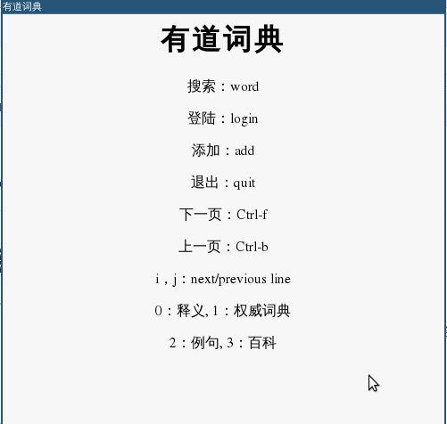
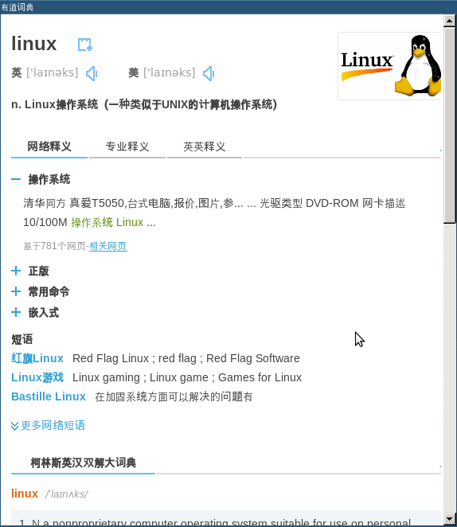
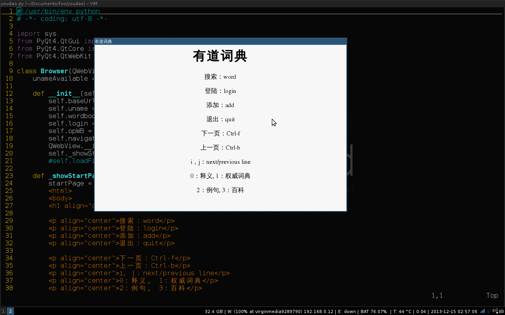
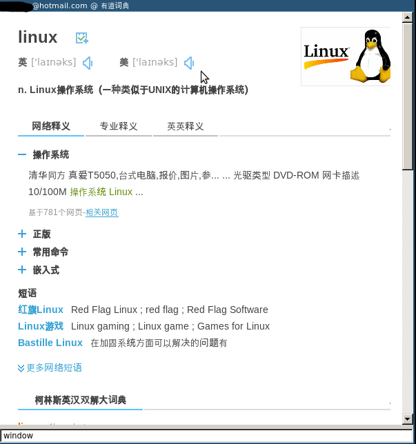

简化的有道网页搜索。
======

功能：
--------
1. 清理页面，让网页更加干净
2. 独立窗口，不需要在浏览器标签页之间来回切换。针对我个人使用更加方便。配合i3 wm的scratchpad使用。
3. 简单的快捷键设置，不需要使用鼠标来配合输入跟基本操作。

不足：
----
依赖于网页结构，网页发生变化，必须修改相应源代码。但是我又不想使用有道api，然后自己呈现搜索结果，有道api也不提供个人账信息的获取，对于保存单词等功能还欠缺。

